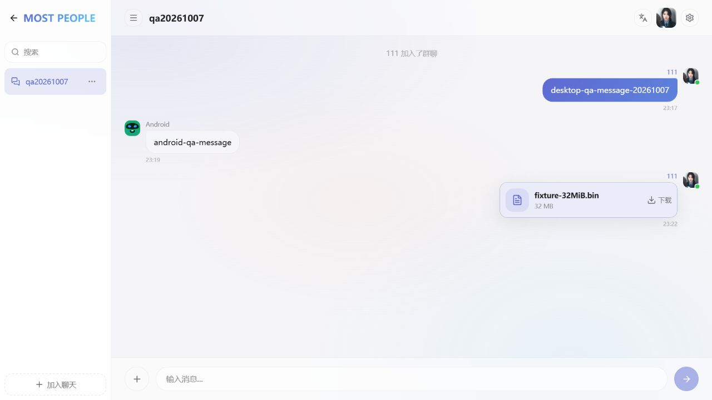

# MostBox 桌面与移动端测试报告（2026-10-07）

本轮依据 `README.md`、`docs/acceptance.md`、Android Alpha 和 iOS 可行性验收文档，验证当前版本是否具备进一步建设“去中心化聊天与可靠大文件传输”的基础。测试完成后再制定改造计划，本轮未修改业务实现。

执行时间为北京时间 2026-10-07 至 2026-10-08，证据按开始日期归档。

**结论：现有自动化测试全部通过，当前构建仍存在阻断实际使用的问题。生产桌面界面、大文件内容身份、移动端内容可用性、系统导出和真实网络做种交接都需要先修复。不能据此宣布全平台验收通过，也不能承诺无限大小文件或手机永久在线。**

改造顺序见 [可靠性改造计划](reliability-upgrade.md)。

## 测试基线与范围

| 项目     | 本轮环境                                                                                     |
| -------- | -------------------------------------------------------------------------------------------- |
| 源码     | `48c58dd064de86c48c3ba529bfc2b69232141efd`，开始时工作区干净                                 |
| 产品版本 | 根包与移动端均为 `0.5.3`                                                                     |
| 桌面     | Windows 11 专业版，build 26200；Electron 43.3.0，运行当前源码的主进程与生产静态资源          |
| 工具链   | Node.js 24.14.1、npm 11.14.0、JDK 17、Android SDK                                            |
| Android  | `mp_peer_api36` 模拟器，Android 16 / API 36，x86_64，2GiB RAM，Java heap growth limit 192MiB |
| iOS      | 完成共享 TypeScript 检查与 Bare bundle；没有 macOS、Xcode 或已连接 iPhone                    |
| 网络     | 本机 Windows + Android 模拟器 NAT + 公共 Hyperswarm DHT；不代表真实手机蜂窝网络              |
| 数据隔离 | Electron 使用临时 home、userData、Documents；使用合成频道、消息和文件；未使用用户重要文件    |

测试包含自动化回归、构建、生产启动、开发界面业务操作、Android 原生 UI、桌面与 Android 互通、真实网络发现、隔离核心故障注入和大文件诊断。移动核心在 Node 上运行的诊断与 Android 原生测试分别标注。

本轮 Windows Electron 启动测试使用隔离启动器，加载实际 `electron/main.js`，没有注册系统默认协议。没有重新验证安装器、更新器或系统协议注册。既有验收文档中的历史真机通过记录，不作为本轮通过证据。

## 自动化与构建结果

| 检查                                    | 结果 | 数量或说明                                              |
| --------------------------------------- | ---- | ------------------------------------------------------- |
| 根项目 `npm test`                       | 通过 | 664 tests / 152 suites                                  |
| `npm run test:frontend`                 | 通过 | 92 tests / 7 suites                                     |
| `npm run test:desktop`                  | 通过 | 15 tests / 2 suites                                     |
| 移动端 `npm test`                       | 通过 | TypeScript 85 + backend/scripts 64，共 149 tests        |
| `npm run test:protocol`                 | 通过 | 11 tests / 7 suites；属于根项目测试的选定子集           |
| 根项目 typecheck、strict-router、lint   | 通过 | 静态检查                                                |
| 根项目 check:versions、format:check     | 通过 | 版本一致，初始格式检查通过                              |
| 移动端 typecheck                        | 通过 | 共享 TypeScript                                         |
| 移动端 bundle:android、bundle:ios       | 通过 | Bare bundle；不是 iOS 原生构建                          |
| 根项目 build、check:static-output       | 通过 | 静态产物存在，但运行时界面失败，见 F1                   |
| Android build:emulator                  | 通过 | 当前源码 x86_64 APK，已安装并操作                       |
| Android build                           | 通过 | 当前源码 arm64-v8a APK，仅验证构建，没有 ARM64 真机安装 |
| `npx --no-install expo install --check` | 失败 | 9 项依赖与 Expo 推荐版本不一致，见 F7                   |

四组主测试共 **920 次测试执行通过**，另有协议子集复跑。该数字不能替代生产启动和真实网络验收。

本轮生成的 APK：

| APK                                         | 大小     | SHA-256                                                            |
| ------------------------------------------- | -------- | ------------------------------------------------------------------ |
| `mostbox-android-0.5.3-emulator-x86_64.apk` | 57.4MiB  | `fc50dcf81a7a38505982b2eb3c20537c26ef285658bd8f631ff58f295df3f128` |
| `mostbox-android-0.5.3-release.apk`         | 56.12MiB | `5fba83746a5ede13a13be19f96e8b03ec5a2b5f103db248af387424e269a1824` |

这些是本轮本地测试构建，不是重新发布或商店签名验收。没有修改版本或发布既有 APK。

## 实际操作结果

| 场景                                            | 结果         | 观察                                                                |
| ----------------------------------------------- | ------------ | ------------------------------------------------------------------- |
| Windows Electron 启动生产页面                   | 失败         | 窗口与 daemon 启动，`/chat/` 页面空白                               |
| 浏览器加载 daemon 的生产 `/`、`/chat/`          | 失败         | 同样发生 Scalar chunk 初始化异常                                    |
| Vite 开发界面聊天、文件入口                     | 通过         | 用于继续业务验收；不能替代生产构建通过                              |
| 桌面与 Android 加入合成频道                     | 通过         | 频道 `qa20261007`                                                   |
| 跨设备双向文本消息                              | 通过         | 两端均显示对方消息                                                  |
| 桌面刷新、daemon 重启后读取历史                 | 通过         | 频道与消息恢复                                                      |
| Android force-stop / 重启后读取历史             | 通过         | 重新选择频道后历史仍在                                              |
| 桌面发送 32MiB 聊天附件                         | 部分通过     | 桌面有文件卡片；Android 收到文件名和裸链接，不能直接点击接收，见 F6 |
| Android 通过系统 `most://` deep link 接收 32MiB | 通过         | 确认接收后下载完成，加入 holding 并显示做种中                       |
| Android 重启恢复 32MiB holding / topic          | 通过         | 恢复记录、重新 join；不等于外部可下载                               |
| Android 发布 1MiB 文件                          | 通过         | 原生系统选择器选取，CID 与桌面核心计算一致，生成做种记录            |
| Android 保存 1MiB 到系统目录                    | 通过         | SAF 导出完成，另存副本 SHA-256 与原文件一致                         |
| Android 保存 32MiB 到系统目录                   | 失败         | Java OOM，目标文件为 0 字节，见 F4                                  |
| Android 无在线种子下载 / 重试                   | 通过失败处理 | 提示“暂未发现在线种子”，传输页显示失败及重新下载入口                |
| 关闭桌面发布者，仅 Android 做种，干净节点下载   | 失败         | 60 秒及 120 秒两次均无 peer，见 F5                                  |
| Android 独立发布 1MiB，干净桌面核心下载         | 失败         | 60 秒无 peer；同一模拟器网络，不能推算普遍失败率                    |
| 桌面 2112MiB 文件发布                           | 通过发布阶段 | 得到链接并写入 Hyperdrive；后续校验发现 CID 不稳定                  |
| 桌面 2112MiB 文件隔离复制 / 下载校验            | 失败         | IntegrityError，拒绝保存和做种，见 F2                               |
| 移动生产核心在 Node 发布 2112MiB                | 通过发布阶段 | 不代表 Android 大文件上传成功；CID 与桌面计算不同                   |
| 默认限制之上的文件发布                          | 正确拒绝     | `10GiB + 1 byte` 被 FileSizeError 拒绝；目前不是无限大小            |



## 故障与优先级

### F1 / P0：生产界面空白

复现：运行当前 `npm run build` 产物，由实际 Electron daemon 提供；打开根路径或 `/chat/`。浏览器和 Electron 均只有背景，没有可用聊天界面。后台正常启动，不能用“服务在线”判断客户端可用。

控制台错误：

```text
TypeError: ce is not iterable
  at ue (.../assets/scalar-Czzp00Pl.js:3:665)
  at .../assets/scalar-s6qKETjY.js:3:14818
```

关联检查入口：`vite.config.ts` 的 Scalar codeSplitting groups、Scalar 依赖导入和生产初始化。错误位置支持优先检查分包与初始化顺序，**尚未证明具体根因**。现有 check:static-output 只证明产物存在。

证据：[生产错误](qa/2026-10-07/desktop-production-errors.json)、[空白页面](qa/2026-10-07/desktop-production-blank.png)。

### F2 / P0：相同大文件计算出不同 UnixFS CID

合成文件大小 `2,214,592,512 bytes`，即 2112MiB / 2.0625GiB。文件由 1MiB 模式块组成，每块前四字节为块序号 little endian。原文件与发布者 Hyperdrive 全流的 SHA-256 均为：

```text
e8b3f6eac38b4c516c09ef47b639f4f0edb479ca9dcf3c9227b8f1dd08bc87b1
```

同一个未修改文件连续计算三次，结果不一致：

```text
bafybeieovbe4qwuiq6xgx7bp7uvlhafh3b42a3s2w5r637sb65bi5wamvq
bafybeih3yfrj7jj7lfxub2cmlc4pbndxth32uxhmvylddwksy66i5d5ydu
bafybeieovbe4qwuiq6xgx7bp7uvlhafh3b42a3s2w5r637sb65bi5wamvq
```

1、32、64、256MiB 对照文件各连续三次均稳定。不能据此确定故障恰好从 2GiB 开始；需要补充边界与内容分布测试。

隔离测试用 `disableNetwork` 和强制本地复制，已经排除“必须打洞才能复现”的解释。发布生成的 CID 与下载重算不同，下载正确抛出 IntegrityError。独立复算原文件也不稳定，说明需要先解决内容身份计算。**不能通过跳过 CID 校验、改用 SHA-256 链接或添加另一种分享格式绕过。**

入口：`server/src/core/cid.js`、`mobile/app/backend/mobile-core.mjs` 的 calculateCid，以及锁定的 importer 和流式输入。具体根因尚未定位。

证据：[重复计算](qa/2026-10-07/cid-stability-results.json)、[大文件复制](qa/2026-10-07/large-file-results.json)、[原文件与 Hyperdrive 对照](qa/2026-10-07/large-diagnostic-results.json)。诊断文件中一次“移动重启后下载”误用了桌面计算的不同 CID，该项不作为独立产品故障；随后使用移动端自己发布的链接，本地已有判断通过。

只读复算示例，工作目录为仓库根目录，传入本机已存在的测试文件：

```powershell
node --input-type=module -e 'import { calculateCid } from "./server/src/core/cid.js"; for (let i = 0; i < 3; i++) console.log((await calculateCid(process.argv[1])).cid.toString())' 'C:\path\large-2112MiB.bin'
```

### F3 / P0：移动核心把缺失内容误报为“本地已有”

故障注入使用实际 MobileP2PCore，在 Node 上运行并替换为离线 swarm：发布 27 字节文件，停止核心，清除 Hyperdrive `/<cid>` 的本地 blob，保留 metadata 与 holding，再重启并下载同一链接。

结果：`drive.has` 从 true 变为 false，entry 仍存在；downloadLink 却返回 `alreadyExists: true`、`completed`、100%，holding 标记 active / topicJoined。

`mobile/app/backend/mobile-core.mjs` 的已有分支仅检查 `existingHolding && existingEntry`，违反“本地必须可按 CID 读到完整内容”的不变量。需要与桌面端已有判断对齐，修复启动恢复和缺失内容状态。

证据：[内容缺失注入结果](qa/2026-10-07/mobile-content-probe-results.json)。这是共享移动核心验证，不是 Android 真机文件损坏测试。

### F4 / P1：Android 32MiB 系统导出发生内存溢出

实际 x86_64 APK：接收完成后打开文件详情 → 保存 → SAF 选择专用测试目录。32MiB 文件失败，错误包含：

```text
ExponentFileSystem.readAsStringAsync
java.lang.OutOfMemoryError
Failed to allocate a 44739264 byte allocation
growth limit 201326592
```

`mobile/app/App.tsx` 的 writeSafFileFromLocalFile 先把整个文件读成 base64，再写 SAF URI。32MiB 的 base64 字符串约 42.7MiB，还叠加原生和 JS 内存。失败后目标目录留下 0 字节文件。

1MiB 对照导出成功，SHA-256 `92bbc339b375fd565755f63c6027326b0cb2a7b7cce35302660db24fea1c7482` 与源文件一致。不能把模拟器的 32MiB 失败阈值推广到所有手机，但整文件 base64 路径无法支撑可靠大文件体验。

证据：[OOM 界面](qa/2026-10-07/android-save-oom.png)、[小文件导出成功](qa/2026-10-07/android-small-export-success.png)、[导出副本哈希](qa/2026-10-07/android-small-export-sha256.log)。

### F5 / P1：真实网络做种交接未通过

桌面发布 32MiB → Android 下载成功并前台做种 → 停止原桌面发布者 → 独立空数据目录 verifier 通过公共 DHT 下载，未注入 replicateWith。

第一次 60 秒无 peer；Android 重启并恢复前台做种后，再用新的空数据目录等待 120 秒，仍抛出 PeerNotFoundError。另一次 Android 自己发布 1MiB 的反向下载也在 60 秒内没有发现 peer。

该结果说明本轮环境未达到最高优先级验收，不足以判定具体 NAT 类型、全球失败率或所有 Android 均失败。需要记录 discover、announce、握手和实际可供内容，区分“本机加入 topic”“发现 peer”“可被另一节点下载”。

底层 HyperDHT 已存在 `relayThrough` / blind-relay 能力；当前桌面与移动 swarm 初始化未接入可配置数据中继和自动切换策略。不能把 bootstrap 节点、DHT 的信令 relay 或远程 daemon 直接当作文件数据中继。

证据：[交接首次尝试](qa/2026-10-07/real-network-verifier-results.json)、[交接重试](qa/2026-10-07/real-network-verifier-retry-results.json)、[移动独立发布反向下载](qa/2026-10-07/mobile-publish-verifier-results.json)、[Android 做种界面](qa/2026-10-07/android-download-seeding.png)。

### F6 / P1：Android 聊天附件无法直接进入下载流程

桌面显示文件卡片和下载按钮，Android 相同消息只显示“附件：路径”和原始 most:// 文本，没有可操作的附件按钮。必须通过系统 deep link 才能继续本轮下载测试。

`mobile/app/src/features/chat/ChatScreen.tsx` 的附件渲染为 Text，未连接 receive 确认流程。需要复用现有解析、确认、任务和文件详情能力，不引入文件名作为身份判断。

证据：[Android 聊天截图](qa/2026-10-07/android-chat.png)。

### F7 / P2：Expo 推荐依赖版本未对齐

检查报告 9 项偏差，包括 Expo 57.0.10 → 推荐 ~57.0.27、React Native 0.86.2 → 推荐 0.86.3、expo-file-system 57.0.1 → 推荐 ~57.0.7。原生构建仍通过，**没有证据证明版本偏差导致 F2 或 F4**。后续作为单独的小范围升级验证，避免与协议或中继改造混在一起。

证据：[依赖检查](qa/2026-10-07/expo-dependency-check.log)。

## 源码审查发现的能力边界

- 默认单文件限制为 10GiB；节点仍有 maxFileSizeBytes、capacityBytes 和磁盘容量保护。“没有微信式小附件限制”可以作为方向，“无限资源”不成立。
- 桌面与移动下载失败会清理临时文件；移动传输列表在重启后未保留已完成任务。本轮验证 holding 恢复，未证明传输任务与进度能跨进程恢复。Hypercore 可能保留部分数据，不能据此声称每次重试都重新传输全部网络字节。
- Android 当前 runtime policy 的 hasNativeForegroundService 为 false；承诺范围仍是前台运行与回前台恢复。未实现可验收的长期后台传输方案。
- 当前聊天是 P2P 频道复制，没有面向收件人的端到端加密、离线投递和手机通知闭环。底层 Noise 连接加密不等于私聊内容只有收件人能读取。
- 可连接远程 MostBox daemon 是已有能力；本轮没有设置公网远程服务、生产凭据或付费节点，也没有验证远程节点身份和服务故障切换。

## 未完成的验收

| 项目                                       | 原因 / 后续要求                                          |
| ------------------------------------------ | -------------------------------------------------------- |
| Android ARM64 真机、不同厂商省电行为       | 本轮无已连接物理设备                                     |
| iPhone 原生构建、签名、真机 P2P            | 本轮没有 Apple 构建环境与设备                            |
| macOS、Linux 桌面                          | 当前仅 Windows 环境                                      |
| Windows 安装、升级、系统 most:// 注册      | 本轮是隔离的源码 Electron 启动，未走安装器               |
| 2GiB 以上跨设备完整下载与系统保存          | 核心 CID 不稳定先阻断；Android 仅测试 32MiB 下载和导出   |
| Wi-Fi ↔ 蜂窝切换、UDP 完全封锁、中继失效   | 需要可控网络与实际中继服务                               |
| 长时间锁屏、Doze、进程被系统回收           | 本轮仅前后台返回和 force-stop 重启恢复                   |
| 断点续传、磁盘满、目录权限撤销、长时间性能 | 尚需专项测试；不能由单元测试或小文件结果推断通过         |
| 多人长期聊天、语音、多账号恢复、Web3 操作  | 不属于本轮已经实际操作通过的主线；现有相关自动化测试通过 |

详细日志和临时复现脚本保留于 `%TEMP%/mostbox-qa-20261007`。本目录中的小型证据已复制到 `docs/qa/2026-10-07/`，大型合成文件和隔离 Corestore 不作为仓库产物保留。后续修复必须重新执行本报告的失败场景，再补齐物理设备矩阵。

清理临时合成文件的操作被自动审批策略拒绝，工具仅返回 `blocked by policy`，未给出更具体原因。因此临时目录中的大文件与 Corestore 仍保留；它们未复制进仓库。
