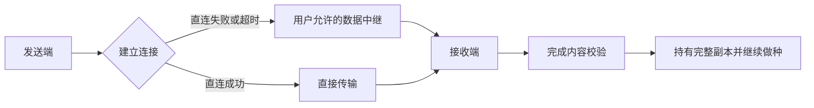

# MostBox 可靠性改造计划

依据 [2026-10-07 测试报告](qa-2026-10-07.md)。这是待实施的工程计划，不是现有功能或新发布承诺。

目标是让 MostBox 从“在线时能聊天和传播文件”逐步具备接近日常通信工具的可靠性：用户直接发消息、点附件接收；连接失败能自动使用可替换的中继；手机被挂起或网络中断后可以恢复任务。第三方节点提供可选服务，用户仍能直连、自托管或更换供应商。

先修内容与客户端可靠性，再接中继，之后推进手机后台与离线消息。区块链不解决打洞、后台挂起、导出内存或 CID 不稳定，因此不进入这一轮主线。

## 目标、约束与成功标准

保留 `most://`、UnixFS CID v1、当前 importer 参数、`cid.multihash.digest` topic、Hyperdrive `/<cid>`、完整副本和下载后自动做种。不引入 magnet 双格式、分布式文件分片、纠删码或上链文件协议。文件名和保存路径始终只用于展示与落盘。

保留节点 maxFileSizeBytes、capacityBytes 和磁盘容量保护。产品目标可表述为“支持大文件，实际容量取决于设备和节点配置”。上调默认限制需要大文件与空间测试证明，不能仅把常量设为无限。

这轮验收的核心是：**生产客户端可用、同一内容 CID 稳定、所有成功状态对应真实可读内容、发布者退出后其他在线种子仍能完成传播；直连失败时可以使用用户允许的中继。**

需要明确的边界：实时数据中继只能帮助仍在线的两个端点连接；发送者离线后仍能收到消息需要额外的消息暂存，接收者在发送者离线后下载附件则需要至少一个在线完整种子。增加中继不会自动获得离线消息或永久文件保存。

## 阶段 1：消除 P0，恢复可发布基线

2026-10-08 实施记录见 [首批 P0 验收](p0-implementation-2026-10-08.md)。生产启动、CID 稳定性与移动本地可用性的代码修复已完成；真实网络可达性和移动系统导出仍按后续阶段处理。

| 工作                   | 范围                                                                             | 验证门槛                                                                                                              |
| ---------------------- | -------------------------------------------------------------------------------- | --------------------------------------------------------------------------------------------------------------------- |
| 修复生产启动           | 定位 Scalar 分包、依赖与初始化异常，精准修复；为实际 build 增加运行时冒烟        | 由 daemon 提供 production 资源，Electron 和浏览器的 `/`、`/chat/`、`/file/`、`/admin/` 正常渲染；关键流程无未处理异常 |
| 修复 CID 稳定性        | 先独立重现并定位 importer、输入流和布局行为；对比桌面 Node 与移动 Bare           | 同一 2112MiB 文件多次、不同输入块边界、桌面与移动核心产生同一 CID；完整下载重新计算一致                               |
| 补齐 CID 黄金样本      | 保存可确定生成的内容规范和预期 CID，覆盖零字节、叶块边界、树布局边界和 2GiB 附近 | 现有黄金样本不变；大文件专项测试可独立运行，不拖慢全部小型测试                                                        |
| 修复本地已有与做种状态 | 移动端检查本地完整 blob / 可读性；启动时发现缺失内容进入需处理状态               | 删除 blob、保留 metadata 后不能返回 completed / alreadyExists；修复或重新下载后才能作为种子                           |

若必须升级 importer，先证明既有 CID 黄金样本与跨端兼容性。禁止放宽下载校验掩盖不一致；如果确有协议兼容问题，应作为单独迁移决策处理。

阶段出口：本轮 F1、F2、F3 均有有效回归验证，生产客户端能够完成现有 MVP。没有这一出口，后续的中继连接率统计和大文件体验测试没有可靠基础。

## 阶段 2：修复移动文件体验和任务恢复

2026-10-08 第二批已实现第 1–3 项：Android 原生流式导出、输出校验与失败清理，以及聊天附件接收入口。移动测试、原生流复制测试与 APK 构建通过；32MiB 保存、同名副本和取消已实测。2026-10-09 又通过 ARM64 真机附件接收、系统打开、手机种子接力及 256MiB / 2112MiB 发布和保存。大文件网络下载、连续内存峰值、提供者故障和任务恢复仍待补，不能宣布阶段 2 达标。记录见 [移动文件体验实施记录](mobile-file-experience-2026-10-08.md)与[真机回归](android-physical-2026-10-09.md)。第 4–6 项继续作为独立批次。

10 月 9 日上午补充：第 4–5 项已有持久化记录、CID 临时文件与字节偏移恢复实现。不同 CID 的真机 256MiB / 2112MiB 网络下载、内存采样、2112MiB 进程停止后恢复与两种大小的手机种子接力均通过，见 [大文件网络验收](android-network-large-2026-10-09.md)。精确阶段切网、空间不足及权限撤销仍需补验；这不会替代中继或后台生命周期验收。

1. Android 系统导出改成原生流式复制：从本地文件流写入 SAF ContentResolver 输出流，文件内容不整包经过 JS / base64。打开、分享、导入也审查是否存在同类路径；只修改实际使用到的链路。
2. 导出成功以真实完成和文件可读为准。权限取消、空间不足和复制失败要关闭流、清理未完成输出或明确标记失败，不留下看似成功的 0 字节附件。覆盖同名文件处理。
3. Android 聊天附件接到现有 receive 确认流程，提供文件名、大小、进度、重试及完成后打开入口。复用 CID 解析和任务状态，不另建一套下载器。
4. 持久化必要传输状态：CID、期望大小、临时文件、已完成范围和校验阶段；区分传输完成与最终 CID 校验完成。重启后恢复任务并重新确认缓存有效性，失败时按原因决定是否保留可恢复数据。
5. 优先复用 Hypercore 已缓存的数据和现有流式能力；需要时支持完整文件的字节偏移恢复。这里的断点不是新建分布式分片文件协议，每个最终种子仍持有完整副本。
6. 将 Expo 依赖对齐作为独立变更，单独跑移动测试、Bare bundle 和原生构建，避免与协议修复混合升级。

验证门槛：192MiB heap 模拟器上的 32MiB 保存通过；真机验证 256MiB 和 2GiB 以上文件的发布、下载、导出，峰值内存不随文件大小线性增长。在 10%、50%、90% 进度切网、停止进程和重启，任务状态可恢复，完成后 CID 正确；已有缓存不应无故丢弃。磁盘满和权限撤销必须可恢复且不能误报成功。

## 阶段 3：加入可替换的数据中继

先实现一个可自托管的中继与两个客户端的端到端验证，再接第二个独立供应商验证可替换性。第一版不建设节点市场、智能合约或复杂调度平台。

**接入路径：**先检查当前锁定 HyperDHT 的 `relayThrough` / blind-relay 与 Hyperswarm 集成方式，在桌面和 Bare Worklet 各做最小验证。不要把 DHT announce 的 relayAddresses 当成已经具备文件带宽兜底；其含义包含连接协助。[HyperDHT 官方说明](https://github.com/holepunchto/hyperdht)描述了发现、打洞与 announce 机制；本轮本地依赖源码则确认了数据 relay 入口。两者需分开验收。

2026-10-09 本地实验：`node scripts/check-local-relay.mjs` 创建隔离的回环 DHT 网络与 blind-relay；双方禁用直接打洞及本地直连，发送 1MiB 并核对 SHA256，同时断言双端 relay session、接收端 relaying success 与中继数据字节数。实测 passed，中继接收 1076662 字节（含协议开销）。这只是桌面依赖层的数据通路验证，尚未接入产品连接策略、凭据或供应商配置，不代表 Android、真实 NAT 或 UDP 禁用验收通过。

2026-10-09 接入准备：桌面 `MostBoxEngine` 与 Android `MobileP2PCore` 现在接受可选 `relayThrough` 公钥，并把它传给文件、聊天和 P2P Ping 的 Hyperswarm 实例；默认值为空，保持现有直连行为。该参数是上层注入点，不包含持久化服务配置、凭据、自动故障切换或供应商选择，因此仍不能宣称产品中继策略已完成。

2026-10-09 桌面配置批次：节点配置新增可选 `node.relayPublicKey`（64 位十六进制、32 字节公钥），通过 `/api/node/config` 持久化，重启 daemon 后生效；默认空值代表关闭。节点状态只公开 `relayConfigured`，不会把该配置当作文件权限或 CID 校验。该字段只记录用户自托管或已获准中继的公开身份，不创建服务、凭据、自动切换或付费流量；Android 真机、真实 NAT/UDP 禁用和产品级中继仍未验证。
网络状态也会返回 `relayConfigured`，便于桌面管理台区分“已配置中继入口”和“当前连接已走中继”；后者仍需真实网络日志和端到端测试确认。

直连尝试使用有限时间预算；失败后自动连接用户允许的服务，并允许后来恢复直连。最小状态包括发现中、直连中、中继中、等待种子、暂停和失败。记录建立连接耗时、传输路径、字节数和可理解的失败原因，通过现有 HTTP API / WebSocket 对外提供，管理界面只展示用户需要的信息。

UDP 完全不可用必须单独验证。若现有 relay 仍依赖不可达的 UDP 路径，再评估 TCP / TLS 443 的连接桥接，不能假设启用 relayThrough 就覆盖所有防火墙。适配仍要完成对端身份与内容校验，不把 TLS 服务端可信替代为 CID 可信。

**供应商与付费边界：**第一版支持用户配置服务地址、服务身份和已有访问凭据；允许自托管、免费节点或用户已购买的第三方带宽。身份与文件不因使用中继迁移到供应商。后续若在产品内提供收费服务，先明确单价、计费字节口径、流量上限和用户预算，获得明确授权后才使用付费流量；服务不可用或额度耗尽可切换其他获准节点。

这与“连接远程 daemon”分开：远程 daemon 执行用户的节点任务，数据中继只帮助当前端点传递流量。持续在线的自托管完整种子能提高附件可用性，但不是中继的必备存储能力，也不变成付费存储市场。

验证门槛：

- 可直连环境优先直连；强制无法打洞时经中继完成双向聊天、文件下载和 CID 校验。
- 两端 UDP 完全不可用时，已选定的兜底方案完成通信；不支持时给出明确状态，不能无限等待。
- 传输中停止中继、替换供应商，再连接并恢复任务；最终文件 CID 一致，没有重复聊天消息。
- 不可用、错误身份、过期凭据、额度耗尽和所有种子离线分别有准确错误。
- 至少两个独立可用服务与一个自托管部署验证成功；关闭官方服务不会阻止用户使用其他节点。

建议把“受控网络中 10 秒内连接或进入有效兜底”作为待测的体验目标；这不是当前性能实测，也不是对所有网络的承诺。先记录各网络至少 20 次尝试的成功率及 p50 / p95，再决定正式指标。

## 阶段 4：按平台处理后台与网络变化

Android：对用户主动发起的大文件任务评估合适的原生后台机制、通知与停止操作，配合任务持久化和 Worklet 生命周期。不能把前台服务当作永久后台做种保证。目标 Android 15 及以上时，后台运行的 dataSync 前台服务存在累计时间限制，须处理超时和停止。[Android 官方超时文档](https://developer.android.com/develop/background-work/services/fgs/timeout)

iOS：先按现有可行性文档完成真机前台 P2P、内容校验与做种交接，再验证挂起和恢复。若要求大文件在挂起时继续，需评估可选 HTTPS 节点传输与后台 URLSession；这需要节点提供支持恢复的 HTTP 文件端点，不能直接托管任意 Hyperswarm 流。Apple 的 [文件传输与后台 URLSession 说明](https://developer.apple.com/videos/play/wwdc2023/10006/)支持 HTTP 恢复和系统调度，该能力不等于手机可长期作为 P2P 服务端。

HTTPS 文件适配若推进，必须单独评审协议边界：节点仅在拥有完整 CID 内容时提供文件，下载后仍重算原生 UnixFS CID，并写入 `/<cid>` 成为完整种子；保留 most:// 入口。先用自托管完整种子验证，不新增云端订单、永久存储承诺或链上存储协议。

界面区分“本机当前做种”“本机已挂起”“远程节点仍在线”。手机后台不可用时明确展示，而不是将已加入 topic 标记为外部始终可用。

验证门槛：真机 Wi-Fi ↔ 蜂窝切换、锁屏、Doze、系统回收、用户强制退出、权限撤销和恢复前台均有日志与结果；恢复后继续校验和做种。用户强制退出与系统回收分别测试，不承诺强制退出后自动常驻。

## 阶段 5：推进日常聊天的身份、隐私与离线投递

频道聊天稳定之后，再设计私聊和私密群，至少包括设备身份、联系人验证、面向收件人的端到端加密、稳定消息 ID、去重、送达状态和多设备恢复。当前公开频道不应被重新描述为已具备这些保证；私密模型需要明确版本和迁移边界。

手机双方不能始终同时在线，因此需要可选、可自托管、可替换的加密消息暂存与推送通知。中继只转发在线流量；消息暂存与持续做种分别处理消息和附件的离线可用性。暂存设置明确保留期限与清理规则，不承诺永久历史。供应商不能因承担服务而获得聊天明文或身份私钥。

这一阶段另立设计与验收：接收端离线时发送、恢复后收到一次、重复投递不重复展示、多设备同步，以及服务替换后的消息与密钥边界。附件加密与公开 CID 分享的关系也需要单独设计，不在当前协议修复中隐式改变“CID 即下载权限”。

## Web3 的位置

保持现有 Web3 工具箱独立。用户聊天、下载、做种和选择中继均不需要钱包。先通过普通服务凭据证明第三方节点连接可靠、用量可核算和供应商可替换。

如果未来确有多供应商结算或跨境付费需求，再比较传统支付与链上结算。此时也不能用 token、质押或合约代替连接可用性和服务测量；消息、附件、联系人和私钥不进入链上。这是后续独立商业与协议决策，本计划不实施 USDT 支付、存储订单或节点经济系统。

## 最终验收矩阵

| 维度         | 必测场景                                                  | 核心判断                                                |
| ------------ | --------------------------------------------------------- | ------------------------------------------------------- |
| 客户端       | Windows 生产构建、Android ARM64 真机、iPhone Release 真机 | 启动与主流程可用；没有仅开发构建通过的情况              |
| 文件         | 小文件、256MiB、2GiB 附近、2112MiB、接近节点配置上限      | 跨核心 CID 稳定，流式运行，下载和导出均正确             |
| 网络         | 同 Wi-Fi、不同 Wi-Fi、蜂窝、严格 NAT、UDP 禁用            | 直连或获准中继能够完成，失败状态明确                    |
| 种子         | A 发布 → B 下载 → A 退出 → C 从 B 下载；B 重启再测        | 干净 C 真正取得完整内容并重算 CID，不能只验 topicJoined |
| 服务         | 中继断开、更换服务、凭据失效、额度不足                    | 可恢复、不会静默扣费或误报成功                          |
| 手机生命周期 | 切网、后台、锁屏、系统回收、force-stop、重启              | 已有内容可读，未完任务恢复，后台能力描述准确            |
| 资源与完整性 | 空间不足、缺失 blob、损坏缓存、同名不同 CID、权限撤销     | CID 身份始终正确，不保存错误内容、不形成假种子          |
| 聊天         | 双向、三节点、重连历史、重复传播、附件接收                | 消息可读且不重复；附件复用同一文件任务闭环              |

每阶段完成对应检查后再扩大范围。首个实施批次应只包含生产启动、CID 稳定性与本地可用性三个 P0；流式导出和附件交互紧随其后，中继以真实网络故障作为验收依据。
